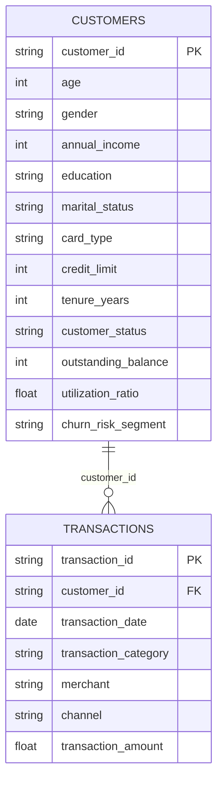

# Credit Card Customer Analytics

> End-to-end banking analytics portfolio project built with **Python, SQL, Streamlit, SQLite, Power BI-ready modeling, and DAX**.

[](https://github.com/roshan7460/Credit-Card-Customer-Analytics-banking-/actions/workflows/ci.yml)


## Live Demo

### [Open the Public Dashboard →](https://htmlpreview.github.io/?https://github.com/roshan7460/Credit-Card-Customer-Analytics-banking-/blob/main/index.html)

The public preview gives recruiters a fast overview of the project. The repository also contains the full interactive Streamlit application with filters and customer-level analysis.

---

## Project Overview

Banks need to understand how customers use credit cards, which segments generate the most value, how spending changes over time, and where customer engagement or utilization may require attention.

This project demonstrates a complete analytics workflow:

```text
Synthetic Banking Data
        ↓
Python Data Generation
        ↓
SQL / SQLite Analysis
        ↓
Customer + Transaction Data Model
        ↓
Streamlit Dashboard
        ↓
Power BI-ready Model + DAX
        ↓
Business Insights
```

### Dataset

| Dataset | Records | Purpose |
|---|---:|---|
| Customers | 2,500 | Demographics, card type, income, credit limit, utilization, risk segment |
| Transactions | 40,000 | Date, category, merchant, channel, transaction value |

The dataset is **synthetic and reproducible** with a fixed random seed, so it is safe to publish and easy to regenerate.

---

## Executive KPIs

| KPI | Portfolio Dataset |
|---|---:|
| Total Customers | 2,500 |
| Total Transactions | 40,000 |
| Total Transaction Value | $4.77M |
| Average Transaction Value | $119.28 |
| Average Credit Limit | $39.4K |
| Average Credit Utilization | 15.8% |

---

## Business Questions

The analysis is designed to answer questions such as:

- Which card segments generate the highest transaction activity?
- Which spending categories contribute the most transaction value?
- Which channels are most important: Online, POS, or Contactless?
- How does transaction value change month by month?
- Which customers have high credit utilization?
- Which customers fall into low, medium, or high churn-risk segments?
- Who are the highest-value customers?
- Which segments may be suitable for retention, cross-sell, or engagement campaigns?

---

## Key Insights

Using the generated portfolio dataset:

- **Shopping** is the largest transaction category, contributing about **25.7%** of total spend.
- **Online transactions** contribute about **46.7%** of total transaction value.
- **Silver cards** represent about **44.8%** of the customer base.
- **18.0%** of customers are classified in the rule-based **High Risk** segment.
- **May 2025** is the strongest month in the generated dataset, with about **$418K** in transaction value.
- Approximately **85.3%** of customers are marked Active.

> The churn-risk segment is a rule-based analytical feature for portfolio demonstration. It is not a production credit-risk or machine-learning model.

---

## Tech Stack

| Layer | Technology | Use |
|---|---|---|
| Data generation | Python, NumPy, Pandas | Reproducible synthetic customer and transaction data |
| Database | SQLite | Relational storage and SQL analysis |
| Analysis | SQL | KPI, customer, category, channel, utilization and trend analysis |
| Dashboard | Streamlit, Plotly | Interactive analytics application |
| BI modeling | Power BI | Dashboard-ready star-style relationship |
| Measures | DAX | Spend, customers, utilization, MoM and YoY metrics |
| Quality | GitHub Actions | Automated smoke testing |

---

## Data Model



Power BI relationship:

```text
Customers[customer_id]  1 ───────── *  Transactions[customer_id]
```

---

## Dashboard Features

The Streamlit dashboard includes:

- Card Type filter
- Gender filter
- Churn Risk filter
- Transaction Date filter
- Executive KPI cards
- Monthly transaction trend
- Spend by category
- Customers by card type
- Spend by transaction channel
- Churn-risk segmentation
- Top 10 customers by spend
- Dynamic business insights

---

## SQL Analysis

`analysis.sql` includes portfolio-ready queries for:

1. Overall customer KPIs
2. Total transaction value and count
3. Card-type performance
4. Monthly transaction trends
5. Top 10 customers
6. Category-level analysis
7. High-utilization customers
8. Churn-risk segmentation
9. Channel performance
10. Customer-value bands

---

## Power BI / DAX

`powerbi_dax_measures.txt` includes measures for:

- Total Spend
- Total Transactions
- Total Customers
- Average Transaction Value
- Spend per Customer
- Average Credit Limit
- Average Utilization
- Active / Inactive Customers
- High-Risk Customers
- Previous Month Spend
- Month-over-Month Growth
- Previous Year Spend
- Year-over-Year Growth

Suggested Power BI report pages:

| Page | Focus |
|---|---|
| Executive Overview | KPIs, transaction trend, card and category performance |
| Customer Analytics | Demographics, customer value and top customers |
| Risk & Transactions | Utilization, churn-risk, category and channel analysis |

---

## Repository Structure

```text
.
├── app.py                       # Interactive Streamlit dashboard
├── data_generator.py            # Reproducible synthetic data
├── build_database.py            # SQLite database builder
├── schema.sql                   # Database schema
├── analysis.sql                 # Analytical SQL queries
├── powerbi_dax_measures.txt     # Power BI DAX measures
├── requirements.txt             # Python dependencies
├── index.html                   # Public recruiter-facing dashboard preview
├── LICENSE
├── .gitignore
└── .github/
    └── workflows/
        └── ci.yml               # Automated smoke test
```

Generated files such as `customers.csv`, `transactions.csv`, and `credit_card_analytics.db` are intentionally excluded from Git because they can be reproduced locally.

---

## Run Locally

### 1. Clone the repository

```bash
git clone https://github.com/roshan7460/Credit-Card-Customer-Analytics-banking-.git
cd Credit-Card-Customer-Analytics-banking-
```

### 2. Create a virtual environment

```bash
python -m venv .venv
```

Windows:

```bash
.venv\Scripts\activate
```

macOS / Linux:

```bash
source .venv/bin/activate
```

### 3. Install dependencies

```bash
pip install -r requirements.txt
```

### 4. Run the dashboard

```bash
streamlit run app.py
```

The application will generate the data automatically on first run.

---

## Build the SQLite Database

```bash
python build_database.py
```

This creates:

```text
credit_card_analytics.db
```

Open it with **DB Browser for SQLite**, **DBeaver**, or a compatible VS Code extension and run the queries from `analysis.sql`.

---

## Use in Power BI

Generate the CSV files:

```bash
python data_generator.py
```

Then:

1. Import `customers.csv`
2. Import `transactions.csv`
3. Create the one-to-many relationship on `customer_id`
4. Add a Date table
5. Add the measures from `powerbi_dax_measures.txt`
6. Build the three recommended report pages

---

## Automated Validation

GitHub Actions validates the project on every push to `main`:

- Python files compile successfully
- Dependencies install correctly
- 2,500 customer records are generated
- 40,000 transaction records are generated
- IDs remain unique
- SQLite database builds successfully
- Transaction row count is verified

A green **CI** badge at the top indicates that the latest automated validation passed.

---

## Resume-Ready Project Description

**Credit Card Customer & Transaction Analytics | SQL, Power BI, DAX, Python**

- Built an end-to-end banking analytics project using **40K transaction records** and **2.5K customer records**.
- Developed SQL queries for KPI analysis, monthly trends, customer segmentation, high-value customers, channel performance, and credit utilization.
- Built an interactive Streamlit dashboard with filters for card type, gender, churn risk, and transaction date.
- Created a Power BI-ready relational model and DAX measures for spend, customer activity, utilization, MoM growth, and YoY growth.
- Added automated GitHub Actions validation to confirm data generation and database integrity.

---

## Important Note

This project is created for **data analytics portfolio and learning purposes**. All customer and transaction records are synthetic. The risk segmentation is not intended for lending, underwriting, creditworthiness, or real-world financial decision-making.

## License

Released under the [MIT License](LICENSE).
